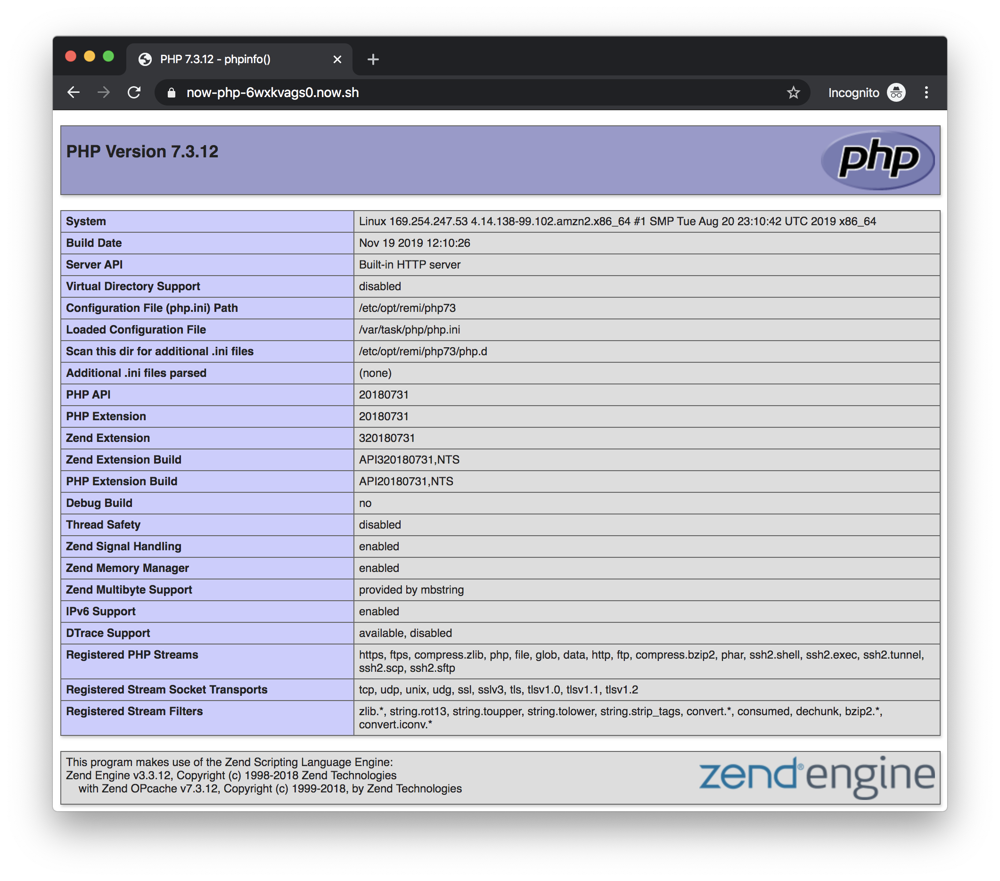

<h1 align=center>ZEIT Now PHP</h1>

<p align=center>
Enjoyable & powerful 🐘 PHP Runtime for ZEIT Now.
</p>

<p align=center>
🕹 <a href="https://f3l1x.io">f3l1x.io</a> | 💻 <a href="https://github.com/f3l1x">f3l1x</a> | 🐦 <a href="https://twitter.com/xf3l1x">@xf3l1x</a>
</p>

<p align=center>
  <a href="https://www.npmjs.com/package/now-php"></a>
  <a href="https://www.npmjs.com/package/now-php"></a>
</p>

<p align=center><strong>🏋️‍♀️ It works with these frameworks and tools.</strong></p>

<p align=center>
  <a href="https://github.com/nette"></a>
  <a href="https://github.com/symfony"></a>
  <a href="https://github.com/illuminate"></a>
  <a href="https://github.com/slimphp"></a>
  <a href="https://github.com/phalcon"></a>
</p>

-----

## 🐣 Versions

|    | Pkg     | Tag          | Stability   | Info                     |
|----|---------|--------------|-------------|--------------------------|
| ✅ | now-php | latest       | production  | Rock-solid stable.       |
| 🔥 | now-php | canary       | testing     | For early-adopters.      |
| ⚠️  | now-php | experimental | development | Testing and high danger. |

> Need to know how things are changing? Here is [changelog](./CHANGELOG.md).

## 🤗 Features

- **Architecture**: PHP development server (🚀 fast enough)
- **PHP version**: 7.4.2RC1
- **Extensions**: apcu, bcmath, bz2, calendar, Core, ctype, curl, date, dom, ds, exif, fileinfo, filter, ftp, gettext, hash, iconv, json, libxml, mbstring, mysqli, mysqlnd, openssl, pcntl, pcre, PDO, pdo_mysql, pdo_pgsql, pdo_sqlite, phalcon, Phar, readline, Reflection, session, SimpleXML, soap, sockets, sodium, SPL, sqlite3, ssh2, standard, swoole, tokenizer, xml, xmlreader, xmlrpc, xmlwriter, xsl, Zend OPcache, zlib
- **Speed**: cold ~250ms / warm ~5ms
- **Memory**: ~90mb
- **Frameworks**: Nette, Symfony, Lumen, Slim, Phalcon

> List of all installable extensions is on this page https://blog.remirepo.net/pages/PECL-extensions-RPM-status.

## ⚙️ Usage

Take a look at [ZEIT's](https://zeit.co) blogpost about [`Serverless Functions`](https://zeit.co/blog/customizing-serverless-functions).

⚠️ ❗️ We're having [some troubles with installing Composer dependencies](https://github.com/juicyfx/now-php/issues/42). Working on that.


Take a look at [ZEIT's](https://zeit.co) blogpost about [`Serverless Functions`](https://zeit.co/blog/customizing-serverless-functions).

You should define `functions` property in `now.json` and list PHP files directly or using wildcard (*).

```json
{
  "functions": {
    "api/*.php": {
      "runtime": "now-php@0.0.8"
    }
  }
}
```

If you need to show index page define `routes` properly.

```json
{
  "functions": {
    "api/index.php": {
      "runtime": "now-php@0.0.8"
    }
  },
  "routes": [
    { "src": "/(.*)",  "dest": "/api/index.php" }
  ]
}
```

Additional function properties are `memory`, `maxDuration`.

```json
{
  "functions": {
    "api/*.php": {
      "runtime": "now-php@0.0.8",
      "memory": 3008,
      "maxDuration": 500
    }
  }
}
```

## 👨‍💻`now dev`

For running `now dev` properly, you need to have PHP installed on your computer, [learn more](errors/now-dev-no-local-php.md).

## 👀 Demo

- phpinfo - https://now-php-server.juicyfx1.now.sh
- extensions - https://now-php-server.juicyfx1.now.sh/ext/
- ini - https://now-php-server.juicyfx1.now.sh/ini/
- test - https://now-php-server.juicyfx1.now.sh/test.php



## 🎯Examples

- [Composer - install dependencies](/examples/composer/)
- [Framework - Lumen](/examples/framework-lumen/)
- [Framework - Nette](/examples/framework-nette/)
- [Framework - Slim](/examples/framework-slim/)
- [Framework - Symfony - Microservice](/examples/framework-symfony-microservice/)
- [Framework - Phalcon](/examples/framework-phalcon/)
- [PHP - common stuff](/examples/php/)
- [Serverless Functions](/examples/functions/)

Browse [more examples](examples). 👀

## 📜 Resources

- [2019/10/23 - Code Examples](https://github.com/trainit/2019-10-hubbr-zeit)
- [2019/10/19 - ZEIT - Deploy Serverless Microservices Right Now](https://slides.com/f3l1x/2019-10-19-zeit-deploy-serverless-microservices-right-now-vol2)
- [2019/08/23 - Code Examples](https://github.com/trainit/2019-08-serverless-zeit-now)
- [2019/07/07 - Bleeding Edge PHP on ZEIT Now](https://dev.to/nx1/bleeding-edge-php-on-zeit-now-565g)
- [2019/06/06 - Code Examples](https://github.com/trainit/2019-06-zeit-now)
- [2019/06/05 - ZEIT - Deploy Serverless Microservices Right Now](https://slides.com/f3l1x/2019-06-05-zeit-deploy-serverless-microservices-right-now) ([VIDEO](https://www.youtube.com/watch?v=IwhEGNDx3aE))

## 🚧 Roadmap

- next-gen PHP runtime ✅
- Composer
  - config.composer: true ✅
  - composer.json detection ✅
- zero config ✅
- `now dev` ✅
- rewrite to typescript ✅
- setup CI ✅
- configure php.ini 🚧
  - using `builds.config` ✅
  - using `build.env` 🚧
- PHP versions
  - 7.4 ✅ (used)
  - 7.3 ✅
  - 7.2 ✅

**Help wanted**

- create many examples (majority frameworks and other use-cases)

## 👨🏻‍💻CHANGELOG

Show me [CHANGELOG](./CHANGELOG.md)

## 📝 License

Copyright © 2019 [f3l1x](https://github.com/f3l1x).
This project is [MIT](LICENSE) licensed.
